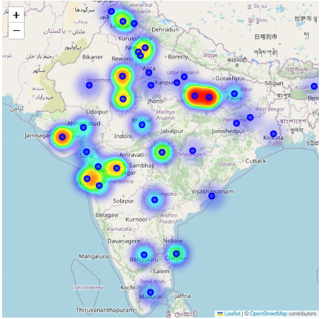

# Project5-EDA-HeatMap-Map-TB-Sufferers-In-India
> **Brief Description:** - The program traces active TB sufferers in different cities in India. The program displays the heatmap on the map of India. The data used here are not realistic as they are program generated but you can replace the numbers with real data and generate this heat map.

---

## Table of Contents

- [Description](#description)
- [Video Explanation](#video)
- [Technologies Used](#technologies-used)
- [Dataset](#dataset)
- [Program Codes ](#program-codes)
- [Screenshots](#screenshots)
- [Contribution](#contributipn)
- [Contact Details](#contact-details)

---

## Description

HeatMap of tuberculosis (TB) sufferers in major cities of India. Distribution of active tuberculosis (TB) cases across different cities in India. This visualizes the geographic spread and intensity of outbreaks.

## Video
<!--
 
-->

We are working on this section. Please check at some other time.

## Technologies-used

Python programming language, pandas, folium, IPython and geopandas package.

## Dataset

The dataset has been generated by another program. However, it is recommended that for real life analysis actual data should be collected and processed properly to get realistic results.

## Program-codes

The programs are written on jupiter notebook, You may run the program on Google colab by clicking on the colab badge below. However, the output may not be generated on colab. For that you have to download the program and run it locally. Make sure that the packages are all installed.

## Screenshots

**This program creates an interactive heatmap to visualize the distribution of tuberculosis (TB) sufferers across major Indian cities. Here’s what can be understood from its output in layman's terms:**

- **Interactive Map:**

  - The map is centered around India and allows users to zoom in and out to explore different regions more closely.
  
- **Heatmap Layer:**

  - The heatmap shows areas with higher concentrations of TB sufferers. The intensity of the color indicates the number of TB cases, with brighter areas representing higher numbers of TB sufferers.
  
- **City Markers:**

  - Blue circle markers are placed on the map to indicate the locations of major cities. Each marker includes a popup that displays the name of the city and the number of TB sufferers in that city.
  
- **Data Visualization:**

  - By looking at the heatmap, users can easily identify TB hotspots where the number of sufferers is particularly high. The color gradient provides a visual representation of how severe the TB burden is in different cities.
  
- **Geographical Insights:**

  - The map helps to see the geographical spread of TB cases across India. It highlights specific regions that are more affected by TB, which can be useful for public health planning and resource allocation.

In summary, this interactive heatmap allows users to visually explore and understand the distribution and intensity of TB cases across major Indian cities, making it easier to identify which areas need more attention and resources to combat the disease.

## Contribution

The programs are written by Santanu Karmakar

## Contact-details

If you wish to contact me, please leave a message (Preferably WhatsApp) on this number: 6291 894 897.
Please also mention why you are contacting me. Include your name and necessary details.
Thank you for taking an interest.
